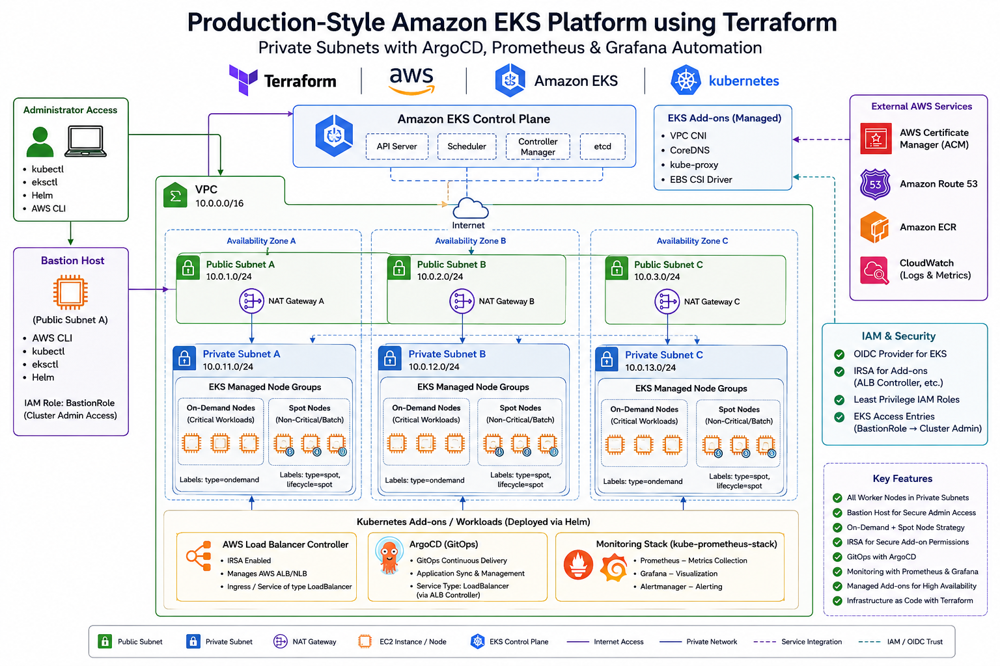

## Architecture



# Project Overview

This project provisions a production-ready Amazon EKS (Elastic Kubernetes Service) cluster on AWS using Terraform.

Instead of relying on a single eksctl command, the entire infrastructure is created and managed through Infrastructure as Code (IaC), providing complete visibility, repeatability, scalability, and version control.

The goal of this project was not just to create an EKS cluster but to understand and implement the underlying AWS networking, security, and Kubernetes architecture that powers production Kubernetes environments.


# Infrastructure Components
## Networking
- Custom VPC
- Public and Private Subnets across multiple Availability Zones
- Internet Gateway
- Route Tables
- Route Table Associations
- CIDR-based subnet allocation using Terraform functions
- High Availability network design
## Amazon EKS
- Managed Kubernetes Control Plane
- Managed Node Group
- Cluster Endpoint Configuration
- Kubernetes Provider Integration
- AWS Authentication via AWS CLI Token
## Security
- IAM Roles
- IAM Policies
- EKS Cluster Role
- Node Group Role
- Least Privilege Access Model
## Infrastructure as Code
- Terraform Modules
- Reusable Variables
- State Management
- Resource Tagging
- Declarative Infrastructure Provisioning
## Production Components
- AWS Load Balancer Controller
- ACM TLS Certificates
- IRSA (IAM Roles for Service Accounts)
- Prometheus & Grafana Monitoring
- ArgoCD GitOps Deployment

# Prerequisites

Before getting started, ensure you have:

* AWS Account
* Ubuntu/Linux Machine
* IAM User with required permissions
* Internet Connectivity

---

# Install Terraform

```bash
wget -O - https://apt.releases.hashicorp.com/gpg | sudo gpg --dearmor -o /usr/share/keyrings/hashicorp-archive-keyring.gpg

echo "deb [arch=$(dpkg --print-architecture) signed-by=/usr/share/keyrings/hashicorp-archive-keyring.gpg] https://apt.releases.hashicorp.com $(grep -oP '(?<=UBUNTU_CODENAME=).*' /etc/os-release || lsb_release -cs)" | sudo tee /etc/apt/sources.list.d/hashicorp.list

sudo apt update
sudo apt install -y terraform packer git jq unzip
```

Verify installation:

```bash
terraform version
```

---

# Install AWS CLI

```bash
sudo apt install -y unzip jq

curl "https://awscli.amazonaws.com/awscli-exe-linux-x86_64.zip" -o "awscliv2.zip"

unzip awscliv2.zip

sudo ./aws/install
```

Configure AWS credentials:

```bash
aws configure
```

Validate authentication:

```bash
aws sts get-caller-identity
```

---

# Install kubectl

```bash
sudo apt-get update

sudo apt-get install -y apt-transport-https ca-certificates curl gnupg

curl -fsSL https://pkgs.k8s.io/core:/stable:/v1.33/deb/Release.key | sudo gpg --dearmor -o /etc/apt/keyrings/kubernetes-apt-keyring.gpg

sudo chmod 644 /etc/apt/keyrings/kubernetes-apt-keyring.gpg

echo 'deb [signed-by=/etc/apt/keyrings/kubernetes-apt-keyring.gpg] https://pkgs.k8s.io/core:/stable:/v1.33/deb/ /' | sudo tee /etc/apt/sources.list.d/kubernetes.list

sudo chmod 644 /etc/apt/sources.list.d/kubernetes.list

sudo apt-get update

sudo apt-get install -y kubectl bash-completion
```

Enable shell completion:

```bash
echo 'source <(kubectl completion bash)' >> ~/.bashrc
echo 'alias k=kubectl' >> ~/.bashrc
echo 'complete -F __start_kubectl k' >> ~/.bashrc

source ~/.bashrc
```

---

# Install eksctl

```bash
ARCH=amd64
PLATFORM=$(uname -s)_$ARCH

curl -sLO "https://github.com/eksctl-io/eksctl/releases/latest/download/eksctl_$PLATFORM.tar.gz"

curl -sL "https://github.com/eksctl-io/eksctl/releases/latest/download/eksctl_checksums.txt" | grep $PLATFORM | sha256sum --check

tar -xzf eksctl_$PLATFORM.tar.gz -C /tmp

sudo install -m 0755 /tmp/eksctl /usr/local/bin
```

Enable completion:

```bash
sudo apt-get install -y bash-completion

echo 'source <(eksctl completion bash)' >> ~/.bashrc
echo 'alias e=eksctl' >> ~/.bashrc
echo 'complete -F __start_eksctl e' >> ~/.bashrc

source ~/.bashrc
```

---

# Install Helm

```bash
sudo apt-get install curl gpg apt-transport-https --yes

curl -fsSL https://packages.buildkite.com/helm-linux/helm-debian/gpgkey | gpg --dearmor | sudo tee /usr/share/keyrings/helm.gpg > /dev/null

echo "deb [signed-by=/usr/share/keyrings/helm.gpg] https://packages.buildkite.com/helm-linux/helm-debian/any/ any main" | sudo tee /etc/apt/sources.list.d/helm-stable-debian.list

sudo apt-get update

sudo apt-get install helm bash-completion
```

Enable completion:

```bash
echo 'source <(helm completion bash)' >> ~/.bashrc
echo 'alias h=helm' >> ~/.bashrc
echo 'complete -F __start_helm h' >> ~/.bashrc

source ~/.bashrc
```

---

# Deploy EKS Infrastructure

Provision infrastructure using Terraform:

Initialize  Terraform
```bash
terraform init
```

Validate Configuration
```bash
terraform Validate
```

Review Execution Plan
```bash
terraform plan -var-file=dev.tfvars
```

Apply Infrastructure
```bash
terraform apply -var-file=dev.tfvars -auto-approve
```

For staging:

```bash
terraform apply -var-file=stage.tfvars -auto-approve
```

For production:

```bash
terraform apply -var-file=prod.tfvars -auto-approve
```

---

# Verify AWS Load Balancer Controller Versions

```bash
helm repo add eks https://aws.github.io/eks-charts

helm repo update eks

helm search repo eks/aws-load-balancer-controller --versions

helm list -A
```

---

# Verify ArgoCD Chart Versions

```bash
helm repo add argo https://argoproj.github.io/argo-helm

helm repo update

helm search repo argo/argo-cd --versions

helm list -A
```

---

# Verify Prometheus Stack Versions

```bash
helm repo add prometheus-community https://prometheus-community.github.io/helm-charts

helm repo update prometheus-community

helm search repo prometheus-community/kube-prometheus-stack --versions

helm list -A
```

---

# Configure kubectl Access

Update kubeconfig for EKS access:

```bash
aws eks update-kubeconfig \
--name testing-my-cluster \
--region ap-south-1
```

---

# ArgoCD Access

Retrieve ArgoCD Load Balancer endpoint:

```bash
kubectl get svc argocd-server \
-n argocd \
-o json | jq --raw-output '.status.loadBalancer.ingress[0].hostname'
```

Retrieve initial admin password:

```bash
kubectl -n argocd get secret argocd-initial-admin-secret \
-o jsonpath="{.data.password}" | base64 -d
```

---

# Grafana Access

Retrieve Grafana admin password:

```bash
kubectl get secret \
--namespace prometheus \
prometheus-grafana \
-o jsonpath="{.data.admin-password}" | base64 --decode

echo
```

Check Grafana image version:

```bash
helm list -n prometheus

kubectl get pods \
-n prometheus \
-l app.kubernetes.io/name=grafana \
-o jsonpath='{.items[*].spec.containers[*].image}'
```

Reset Grafana admin password:

```bash
kubectl exec \
--namespace prometheus \
-it $(kubectl get pods \
--namespace prometheus \
-l app.kubernetes.io/name=grafana \
-o jsonpath="{.items[0].metadata.name}") \
-- grafana-cli admin reset-admin-password Abcd@1234
```

---

# Delete Kubernetes Resources

```bash
kubectl delete -f .
```

---

# Destroy Infrastructure

Development:

```bash
terraform destroy -var-file="dev.tfvars" -auto-approve
```

Staging:

```bash
terraform destroy -var-file="stage.tfvars" -auto-approve
```

Production:

```bash
terraform destroy -var-file="prod.tfvars" -auto-approve
```

Delete EKS cluster using eksctl:

```bash
eksctl delete cluster \
--name testing-my-cluster \
--region ap-south-1
```

---

# Useful Terraform Commands

Preview changes:

```bash
terraform plan -var-file="dev.tfvars"
```

Apply changes:

```bash
terraform apply -var-file="dev.tfvars" -auto-approve
```

Destroy resources:

```bash
terraform destroy -var-file="dev.tfvars" -auto-approve
```

---

# Environment Support

| Environment | Variable File |
| ----------- | ------------- |
| Development | dev.tfvars    |
| Staging     | stage.tfvars  |
| Production  | prod.tfvars   |

---

# Notes

* Ensure AWS credentials are configured before deployment.
* Update kubeconfig after cluster creation.
* Verify Helm chart versions before upgrading.
* Destroy unused environments to avoid unnecessary AWS charges.
