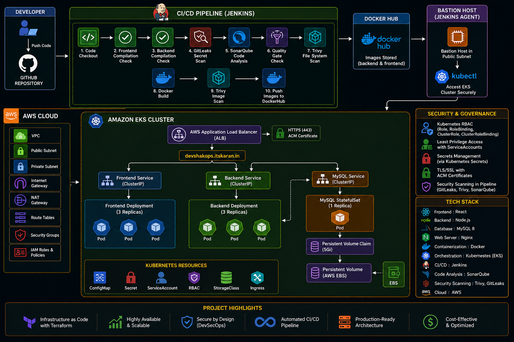

# 🚀 Production-Style DevSecOps Platform on Amazon EKS using Terraform

A complete end-to-end DevSecOps platform built on AWS that automates secure application delivery from GitHub commit to deployment on Amazon EKS.

This project demonstrates real-world DevOps, DevSecOps, Kubernetes, and Cloud Engineering practices by integrating Infrastructure as Code, CI/CD automation, security scanning, containerization, and cloud-native deployment workflows.

---

## 📌 Architecture Diagram



---

## Project Objective

The goal of this project was to design and implement a production-style cloud-native platform that provides:

- Automated Infrastructure Provisioning
- Secure CI/CD Pipeline
- Containerized Application Deployment
- Kubernetes Orchestration
- Persistent Storage Management
- Role-Based Access Control (RBAC)
- HTTPS/TLS Secure Access
- DevSecOps Security Controls

---

# 🏗 Infrastructure Provisioning (Terraform)

The AWS infrastructure is provisioned entirely using Terraform.

### Components Provisioned

Custom VPC

Public Subnets

Private Subnets

Internet Gateway

NAT Gateway

Route Tables

Security Groups

IAM Roles & Policies

Amazon EKS Cluster

Managed Node Groups

---

# ☁ AWS Architecture

The platform follows a production-style architecture:

```text
Internet
    │
    ▼
Application Load Balancer
    │
    ▼
Amazon EKS Cluster
    │
 ┌──┴───────────┐
 ▼              ▼
Frontend     Backend
Pods         Pods
    │
    ▼
MySQL StatefulSet
    │
    ▼
AWS EBS Volume
